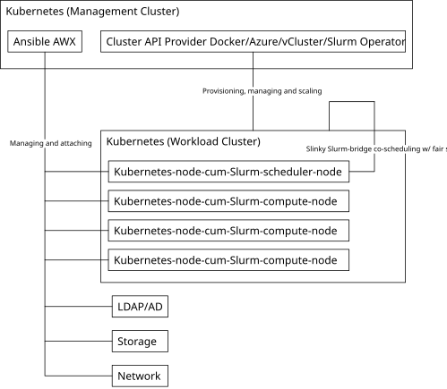

# Cluster API Provider Slinky

Kubernetes-native declarative infrastructure for [Slinky](https://github.com/SlinkyProject)-based converged Slurm and Kubernetes clusters.

## What is the Cluster API Provider Slinky (CAPS)

The [Cluster API](https://github.com/kubernetes-sigs/cluster-api) (CAPI) brings declarative, Kubernetes-style APIs to cluster creation, configuration and management.

CAPS enables efficient management at scale of Slinky-based converged Slurm and Kubernetes clusters, with the nodes dual-managed by both Ansible AWX for Slurm workloads and CAPI providers (Cluster API Provider Docker/Azure/vCluster/etc.) for containerized workloads on Kubernetes, with slurm-bridge bridging Slurm and Kubernetes for fair-share scheduling across both orchestrators.



## Getting started

Currently only local clusters powered by Cluster API Provider Docker (CAPD) is supported.

Create a local Kubernetes cluster as the management cluster.

```bash
envsubst < kind-config.yaml | kind create cluster --config -
kubectl cluster-info --context kind-kind
```

To work around an AWX missing feature regarding using manual projects (see [this](https://github.com/ansible/awx/issues/1288) and [this](https://forum.ansible.com/t/how-to-import-inventory-files-from-ansible/28655/7)), we need to install a Git server, e.g. Gitea.
Set your own administrator username (cannot be `admin`), password and email by saving the following YAML into `gitea-admin-secret.yaml`:

```yaml
apiVersion: v1
kind: Secret
metadata:
  name: gitea-admin-secret
type: Opaque
stringData:
  username: <your admin username>
  password: <your admin password>
  email: <your admin email>
```

Do `kubectl apply -f gitea-admin-secret.yaml` to add the secret to Kubernetes, then deploy Gitea using `gitea-values.yaml` (you may customize the values to your liking):

```bash
helm repo add gitea-charts https://dl.gitea.com/charts/
helm install gitea gitea-charts/gitea -f gitea-values.yaml
```

Upload your cluster-api-provider-slinky repo into this Gitea instance.

Install AWX Operator.

```bash
kubectl apply -f https://raw.githubusercontent.com/kubernetes/ingress-nginx/main/deploy/static/provider/kind/deploy.yaml
helm repo add awx-operator https://ansible-community.github.io/awx-operator-helm/
helm install my-awx-operator awx-operator/awx-operator -n awx --create-namespace -f awx.yaml
# display your AWX admin password
kubectl get secret awx-admin-password -n awx -o jsonpath="{.data.password}" | base64 --decode ; echo
```

Using your AWX `admin` username and password, log in to AWX portal at `localhost:32000`.

Go to `Administration -> Instance Groups -> default`, press `Edit`, then check `Customize pod specification` and paste `pod-spec-override.yaml` into the `Custom pod spec` field, in order for the kubeconfig directory to properly mount into AWX runners, so that AWX can access data of management cluster. (TODO: instead of this kubeconfig mounting hack, properly introduce k8s credentials into AWX via awx-operator or some other methods)

Go to `Resources -> Credentials` and add your Gitea username and password as a credential of type `Source Control`.

Go to `Resources -> Projects` and add a project of Source Control Type `Git`. The Source Control URL should be `http://host.docker.internal:3000/<your gitea admin username>/cluster-api-provider-slinky.git`, with appropriate branch/tag/commit name and Source Control Credential pointing to the credential you added in the last step.

Go to `Resources -> Inventories` and add an inventory. Go to `Sources` of this inventory, add an inventory source `Sourced from a project`, and choose the Project you added in the last step, with Inventory file set as `projects/test/roles/sync/files/run.py`. For Update options, select `Overwrite` and `Update on launch`.

Go to `Resources -> Credentials` and add another credential of type `Machine`, with `root` as username and containing your SSH private key (and passphrase if you have any). This SSH Key would be used by Ansible to access pseudo-nodes bootstrapped by CAPD.

Go to `Resources -> Templates` and add a job template, with Job Type of `Run`, Inventory and project set to what you created in previous steps, Playbook set to `projects/test/run.yml`, and Credentials set to the previous credential. This is a sample Ansible job that collects hostnames of nodes in the inventory, which will trigger the refresh of the inventory (which collects Cluster API node data) every time it runs.

Install [CAPD](https://github.com/kubernetes-sigs/cluster-api/blob/main/test/infrastructure/docker/README.md) and turn your current Kind cluster into a CAPD management cluster, which we will use to create and manage CAPD workload clusters in the steps after.
```bash
export CLUSTER_TOPOLOGY=true
clusterctl init --infrastructure docker
# enhance metadata propagation so that Slinky labels will land on the node (for MachineSet and Machine only; CAPD MachinePool label seems to propagate just fine without this trick)
kubectl -n capi-system patch deployment/capi-controller-manager --type=json -p='[{"op":"add","path":"/spec/template/spec/containers/0/args/-","value":"--additional-sync-machine-labels=.*slinky\\.slurm\\.net.*"}]'
```

open `capi-quickstart.yaml` and modify the SSH public key (corresponding to the private key in AWX) inside `preKubeCommands` (around line 329).

Create the CAPD cluster. wait for the cluster to be ready.
```bash
kubectl apply -f capi-quickstart.yaml
# wait some time
clusterctl get kubeconfig capi-quickstart > capi-quickstart.kubeconfig
# https://cluster-api.sigs.k8s.io/clusterctl/developers#fix-kubeconfig-when-using-docker-desktop-and-clusterctl
# Point the kubeconfig to the exposed port of the load balancer, rather than the inaccessible container IP.
sed -i -e "s/server:.*/server: https:\/\/$(docker port capi-quickstart-lb 6443/tcp | sed "s/0.0.0.0/127.0.0.1/")/g" ./capi-quickstart.kubeconfig
# CAPD nodes won't be ready until we install CNI
kubectl --kubeconfig=./capi-quickstart.kubeconfig apply -f https://raw.githubusercontent.com/projectcalico/calico/v3.30.3/manifests/calico.yaml
# monitor CAPD cluster and wait for it to become ready
watch -c clusterctl describe cluster capi-quickstart --color
```

Run the job in AWX. The job should now output the hostnames of all pseudo-nodes of the CAPD cluster (which are Docker containers under the hood), and the inventory's host list should also contain those hosts. This means that AWX is now aware of these nodes and Ansible can bootstrap SSSD/Storage/networking/etc.

Next, we introduce Slurm into the cluster by installing `slurm-operator`. We need to switch to the CAPD cluster's k8s context first.
```bash
export KUBECONFIG="$(pwd)/capi-quickstart.kubeconfig"
# add a local-path-based StorageClass for Slurm persistence
kubectl apply -f https://raw.githubusercontent.com/rancher/local-path-provisioner/v0.0.32/deploy/local-path-storage.yaml
kubectl patch storageclass local-path -p '{"metadata":{"annotations":{"storageclass.kubernetes.io/is-default-class":"true"}}}'
kubectl patch storageclass local-path -p '{"metadata":{"annotations":{"defaultVolumeType":"local"}}}'
# relax pod security for local storage to work
kubectl label ns local-path-storage pod-security.kubernetes.io/enforce=privileged --overwrite
kubectl label ns local-path-storage pod-security.kubernetes.io/enforce-version=latest --overwrite
helm install cert-manager oci://quay.io/jetstack/charts/cert-manager --version v1.18.2 --set 'crds.enabled=true' --namespace cert-manager --create-namespace
helm install slurm-operator-crds oci://ghcr.io/slinkyproject/charts/slurm-operator-crds
helm install slurm-operator oci://ghcr.io/slinkyproject/charts/slurm-operator --namespace=slinky --create-namespace
helm install slurm oci://ghcr.io/slinkyproject/charts/slurm -f slurm-cluster.yaml --set-file "loginsets.slinky.rootSshAuthorizedKeys=${HOME}/.ssh/id_rsa.pub" --namespace=slurm --create-namespace
kubectl label ns slurm pod-security.kubernetes.io/enforce=privileged --overwrite
kubectl label ns slurm pod-security.kubernetes.io/enforce-version=latest --overwrite
```

In a separate terminal, port forward the Slurm login node:
```bash
kubectl -n slurm port-forward svc/slurm-login-slinky 2222:22
```

Log into the Slurm login node:
```bash
ssh -p 2222 root@127.0.0.1
```

Run Slurm commands to quickly verify that Slurm is functioning:
```bash
sinfo
srun hostname
sbatch --wrap="sleep 60"
squeue
sacct
```

## Locally building Slinky

```bash
# host.docker.internal:5000 is our local container registry for Slinky development
docker run -d --restart=always -p 5000:5000 --name slinky-reg registry:2
# in another slurm-operator repo, run `make push REGISTRY=host.docker.internal:5000/slinky`, then we switch to CAPD cluster and install:
helm install slurm-operator-crds oci://host.docker.internal:5000/slinky/charts/slurm-operator-crds
helm install slurm-operator oci://host.docker.internal:5000/slinky/charts/slurm-operator --namespace=slinky --create-namespace
helm install slurm oci://host.docker.internal:5000/slinky/charts/slurm -f slurm-cluster.yaml --set-file "loginsets.slinky.rootSshAuthorizedKeys=${HOME}/.ssh/id_rsa.pub" --namespace=slurm --create-namespace
kubectl label ns slurm pod-security.kubernetes.io/enforce=privileged --overwrite
kubectl label ns slurm pod-security.kubernetes.io/enforce-version=latest --overwrite
```

## Autoscaling

The autoscaling logical workflow behaves as follows:
- Slurm jobs are submitted
- slurm-exporter exports Slurm job queue data into Prometheus
- Keda (or some other more sophisticated custom logic) scales Slinky NodeSet replicas based on Prometheus data
- more NodeSet replicas lead to unschedulable NodeSet pods
- Cluster Autoscaler sees unschedulable pods, and Cluster API cloud provider of Cluster Autoscaler scales up the MachinePool
- MachinePool increases its number of replicas, which brings more nodes into the workload cluster
- NodeSet pods is now schedulable onto the newly-introduced nodes
- new nodes join the Slurm cluster and pick up the jobs

To set up the autoscaling configuration, we first connect the Cluster Autoscaler to Cluster API. For our CAPD setup,
```bash
# Switch your kubectl context/kubeconfig to the management cluster first
# apply the patch yaml to switch the CAPD cluster compute MachinePool from manual scaling to auto-scalable by CA
kubectl apply -f capi-quickstart-autoscale-patch.yaml
```

## Contributing

This project welcomes contributions and suggestions.  Most contributions require you to agree to a
Contributor License Agreement (CLA) declaring that you have the right to, and actually do, grant us
the rights to use your contribution. For details, visit https://cla.opensource.microsoft.com.

When you submit a pull request, a CLA bot will automatically determine whether you need to provide
a CLA and decorate the PR appropriately (e.g., status check, comment). Simply follow the instructions
provided by the bot. You will only need to do this once across all repos using our CLA.

This project has adopted the [Microsoft Open Source Code of Conduct](https://opensource.microsoft.com/codeofconduct/).
For more information see the [Code of Conduct FAQ](https://opensource.microsoft.com/codeofconduct/faq/) or
contact [opencode@microsoft.com](mailto:opencode@microsoft.com) with any additional questions or comments.

## Trademarks

Slurm® and Slinky® are registered trademarks of SchedMD LLC.

This project may contain trademarks or logos for projects, products, or services. Authorized use of Microsoft 
trademarks or logos is subject to and must follow 
[Microsoft's Trademark & Brand Guidelines](https://www.microsoft.com/en-us/legal/intellectualproperty/trademarks/usage/general).
Use of Microsoft trademarks or logos in modified versions of this project must not cause confusion or imply Microsoft sponsorship.
Any use of third-party trademarks or logos are subject to those third-party's policies.
