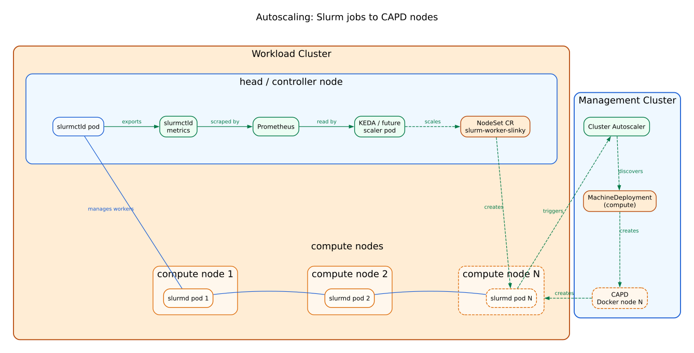

# Autoscaling: From Slurm Jobs to CAPD Nodes

This document explains the end-to-end autoscaling pipeline that dynamically
provisions Kubernetes (CAPD) nodes in response to pending Slurm jobs. The
Pulumi local stack owns both the KEDA NodeSet scaler in the workload cluster
and the Cluster Autoscaler in the management cluster.

## High-Level Flow

```
Slurm pending jobs
  → Prometheus scrapes slurmctld metrics
    → KEDA scales the NodeSet (slurmd pod count)
      → Unschedulable slurmd pods appear
        → Cluster Autoscaler scales the compute MachineDeployment
          → CAPD creates new Docker "nodes"
            → Nodes join the workload cluster
              → slurmd pods are scheduled and register with Slurm
                → Pending jobs run
```

## Components

### 1. Slurm Metrics → Prometheus

The `slurmctld` controller exposes a built-in Prometheus metrics endpoint. The
Pulumi workload-cluster class enables controller metrics in generated Slurm Helm
values and installs kube-prometheus-stack before Slinky so the Slurm chart's
`ServiceMonitor` resources can be created. The key metric is:

```
slurm_partition_jobs_pending{partition="all"}
```

This is the number of Slurm jobs waiting for compute resources.

### 2. KEDA ScaledObject → NodeSet Replicas

Pulumi installs KEDA in the workload cluster and creates a `ScaledObject` that
watches the pending-jobs metric and maps it to the replica count of a Slinky
**NodeSet**:

```yaml
spec:
  scaleTargetRef:
    apiVersion: slinky.slurm.net/v1beta1
    kind: NodeSet
    name: <slurm-release>-worker-compute
  minReplicaCount: 1
  maxReplicaCount: 10
  triggers:
  - type: prometheus
    metadata:
      query: sum(slurm_partition_jobs_pending{partition="all"})
      threshold: '1'
      activationThreshold: '1'
```

When at least one job is pending, KEDA increases the NodeSet replica
count. Each replica becomes one `slurmd` pod, essentially one Slurm compute
node. When pending jobs drop to zero, KEDA reduces replicas back to its
configured minimum.

### 3. Unschedulable Pods → Cluster Autoscaler → MachineDeployment

Because of the **anti-affinity** rule (see below), each slurmd pod requires
its own dedicated Kubernetes node. When KEDA requests more NodeSet
replicas than there are available compute nodes, the new pods become
*unschedulable*.

The **Cluster Autoscaler** runs on the management cluster and watches the
workload cluster through the CAPI-generated workload kubeconfig. The local
Pulumi workload-cluster class installs it as a first-class component and it
responds to unschedulable pods by scaling the compute CAPI
**MachineDeployment**:

```yaml
cloudProvider: clusterapi
clusterAPIMode: kubeconfig-incluster
clusterAPIKubeconfigSecret: local-autoscaler-kubeconfig
clusterAPIWorkloadKubeconfigPath: /etc/kubernetes/value
autoDiscovery:
  namespace: default
  clusterName: local-workload
extraArgs:
  scale-down-unneeded-time: 2m
```

Key details:

- **Auto-discovery** is scoped to the CAPI cluster name. This keeps the
  MachineDeployment, MachineSet, and Machine lookup path under the same filter,
  which Cluster Autoscaler needs when mapping workload Nodes back to CAPI
  Machines.
- **Min/max bounds** are controlled by annotations on the MachineDeployment
  itself (see label/annotation passthrough below).
- **Replica ownership** belongs to Cluster Autoscaler. Pulumi creates the
  MachineDeployment without `spec.replicas` for autoscaled worker classes and
  ignores drift on `spec.replicas` so PKO does not overwrite autoscaler changes.
- **Scale-down** is set to 2 minutes of idle time for demo purposes.
- **CAPD RBAC** is owned by Pulumi and grants access to the
  `infrastructure.cluster.x-k8s.io` API group, which the default Helm chart
  does not include.

### 4. CAPD Creates Docker Nodes

The compute MachineDeployment's infrastructure reference points to a
`DockerMachineTemplate`. When the Cluster Autoscaler increases the
MachineDeployment replica count, CAPI/CAPD creates new Docker containers that
act as Kubernetes nodes. These nodes are bootstrapped with kubeadm and join the
workload cluster.

---

## Label and Annotation Passthrough

Labels and annotations on CAPI resources must propagate all the way down to
the actual Kubernetes `Node` objects so that pod scheduling rules work
correctly. This is the critical glue that ties CAPI provisioning to Slurm
pod placement.

### Where Labels Originate

The local workload cluster has one `KubeadmControlPlane`, one fixed controller
`MachineDeployment`, and one autoscaled compute `MachineDeployment`:

```yaml
workers:
- name: local-head
  replicas: 1
  labels:
    slinky.slurm.net/node-type: controller

- name: local-compute
  # replicas omitted: Cluster Autoscaler owns the live value
  metadata:
    annotations:
      cluster.x-k8s.io/cluster-api-autoscaler-node-group-min-size: '1'
      cluster.x-k8s.io/cluster-api-autoscaler-node-group-max-size: '10'
    labels:
      slinky.slurm.net/node-type: compute
      ca4s.azure.com/autoscaler-enabled: "true"
```

- **`slinky.slurm.net/node-type: controller`** on the fixed controller
  MachineDeployment identifies the worker that runs Slurm head and platform
  services.
- **`slinky.slurm.net/node-type: compute`** on the compute MachineDeployment
  identifies nodes that run slurmd worker pods.
- **`ca4s.azure.com/autoscaler-enabled: "true"`** is a metadata marker on the
  MachineDeployment. Cluster Autoscaler discovery is scoped by cluster name so
  the related MachineSets and Machines remain discoverable during Node mapping.
- The **autoscaler annotations** tell Cluster Autoscaler the allowed scaling
  range (1–10 nodes).

### How Labels Reach Kubernetes Nodes

Controller and compute labels follow the CAPI propagation path from
`MachineDeployment` to `Machine` to `Node`. CAPI only propagates labels that
match a configured allowlist, so the local management setup enables Slinky
labels:

```bash
kubectl -n capi-system patch deployment/capi-controller-manager \
  --type=json \
  -p='[{"op":"add","path":"/spec/template/spec/containers/0/args/-",
        "value":"--additional-sync-machine-labels=.*slinky\\.slurm\\.net.*"}]'
```

This tells the CAPI controller to sync any label matching
`.*slinky\.slurm\.net.*` from Machine to Node. Without it, worker nodes would
not carry their controller/compute roles and required pod affinity would fail.

### Propagation Chain

```
Pulumi controller/compute worker classes
  → MachineDeployment metadata.labels
    → Machine metadata.labels
      → Node role labels  (via --additional-sync-machine-labels)

controller Node label → platform pod affinity
compute Node label    → slurmd pod affinity
```

---

## Anti-Affinity: One slurmd Per Node

The generated Slurm Helm values declare a **hard pod anti-affinity** rule on the
compute NodeSet pods:

```yaml
nodesets:
  slinky:
    podSpec:
      affinity:
        nodeAffinity:
          requiredDuringSchedulingIgnoredDuringExecution:
            nodeSelectorTerms:
            - matchExpressions:
              - key: "slinky.slurm.net/node-type"
                operator: In
                values:
                - "compute"
        podAntiAffinity:
          requiredDuringSchedulingIgnoredDuringExecution:
          - labelSelector:
              matchExpressions:
              - key: app.kubernetes.io/name
                operator: In
                values:
                - "slurmd"
            topologyKey: "kubernetes.io/hostname"
```

This enforces two constraints:

1. **Node affinity** — slurmd pods can only land on nodes labeled
  `slinky.slurm.net/node-type: compute`. This keeps them off controller and
  control-plane nodes.
2. **Pod anti-affinity** — no two pods with label
   `app.kubernetes.io/name: slurmd` may share the same hostname (node).
   This guarantees a strict **1:1 mapping between slurmd pods and compute
   nodes**.

### Why Anti-Affinity is Critical for Autoscaling

The anti-affinity rule is what *bridges* KEDA scaling to infrastructure
scaling:

1. KEDA increases the NodeSet to N replicas (N slurmd pods requested).
2. If only M < N compute nodes exist, the remaining N − M pods are
   **unschedulable** — the scheduler cannot place two slurmd pods on the
   same node.
3. Cluster Autoscaler sees the unschedulable pods and grows the compute MachineDeployment
   until N compute nodes exist.
4. New nodes get the `compute` label via CAPI label passthrough, and the
   pending slurmd pods are immediately scheduled.

Without anti-affinity, Kubernetes could pack multiple slurmd pods onto the
same node, and the Cluster Autoscaler would never be triggered — defeating
the purpose of dedicated compute node provisioning.

---

## Controller Node Placement

Head-node services — `slurmctld`, `loginsets`, and `restapi` — each carry
the same node affinity:

```yaml
affinity:
  nodeAffinity:
    requiredDuringSchedulingIgnoredDuringExecution:
      nodeSelectorTerms:
      - matchExpressions:
        - key: slinky.slurm.net/node-type
          operator: In
          values:
          - controller
```

This same role selects the dedicated controller MachineDeployment on local CAPD
and Azure BYO, and the fixed System pool on AKS. Kubernetes control-plane nodes
are not application placement targets.

Other non-DaemonSet platform components are also pinned to the controller role,
including `cert-manager`, `slurm-operator`, `kube-prometheus-stack`,
`local-path-provisioner`, `coredns`, and `calico-kube-controllers`. The goal is
that no ordinary platform Deployment lands on a compute node and prevents
Cluster Autoscaler from removing that node when Slurm demand drops. DaemonSets
such as `calico-node`, `kube-proxy`, and `prometheus-node-exporter` still run on
every node; Cluster Autoscaler understands DaemonSet overhead and they do not
block scale-in by themselves.

---

## Controller Taint Isolation

Every project-managed controller worker/System pool has one taint:

```yaml
slinky.slurm.net/controller:NoSchedule
```

Platform pods tolerate this taint and use required controller-role affinity.
Compute workers are untainted, and Slurm `NodeSet` pods select them with
compute-role affinity. The taint keeps unconstrained tenant pods off controller
workers, while affinity keeps platform Deployments off compute workers.

Self-managed Kubernetes control-plane nodes retain kubeadm's standard
`node-role.kubernetes.io/control-plane:NoSchedule` taint. That provider-owned
taint is not managed or tolerated by the platform workloads because those pods
target the dedicated controller worker instead.

Placement is rendered directly by the Pulumi workload-cluster class. There are
no separate root-level Helm values files for the managed local stack.

### Who Tolerates the Taint

| Component | Tolerates project controller taint? | How |
|-----------|---------------------------------------|-----|
| Slurm controller/login/restapi | Yes | Generated chart values add the custom toleration and controller-role affinity |
| Pinned platform Deployments | Yes | Generated Pulumi/Helm values add the custom toleration plus controller-role affinity |
| slurmd NodeSet workers | No | They select compute nodes by `slinky.slurm.net/node-type: compute` |
| DaemonSets | Usually yes | Kubernetes DaemonSet defaults or chart tolerations allow node agents everywhere |
| Tenant workloads | No | They stay off controller nodes unless explicitly configured |

AKS uses the same contract on its fixed System pool. Its Azure-managed control
plane is not exposed as schedulable Nodes, so the System pool is the controller
role target.

### NodeSet Placement

```yaml
nodesets:
  slinky:
    podSpec:
      affinity:
        nodeAffinity:
          requiredDuringSchedulingIgnoredDuringExecution:
            nodeSelectorTerms:
            - matchExpressions:
              - key: slinky.slurm.net/node-type
                operator: In
                values:
                - compute
```

---

## Summary Diagram



[Open the autoscaling SVG](images/autoscaling.svg)

[View the Graphviz source](images/autoscaling.dot)
