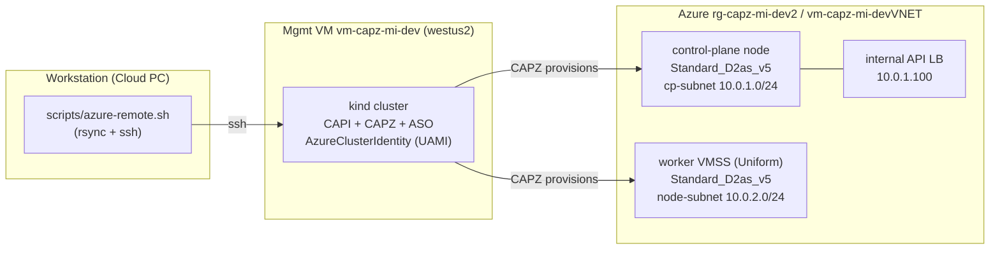

# Self-Managed CAPZ Workload Cluster for HPC-X MPI (`caps-self`)

This documents the **as-is** state of the self-managed (kubeadm + CAPZ) Azure
workload cluster `caps-self` and the intended path to running **HPC-X MPI** jobs
on it under Slurm. It is distinct from:

- the **AKS-managed** workload path (`aks-workload-cluster.yaml`), and
- the **CAPD / Slinky** local dev path (Pulumi `local` stack; `docs/autoscaling.md`).

Source of truth for the cluster shape: [selfmanaged-workload-cluster.yaml](../selfmanaged-workload-cluster.yaml).

> Status legend: **[up]** = exists and verified · **[planned]** = designed, not yet applied.

---

## 1. High-level topology



The workstation never talks to Azure directly. Everything is driven through the
mgmt VM (which holds the UAMI CAPZ authenticates with) via
[scripts/azure-remote.sh](../scripts/azure-remote.sh).

---

## 2. Management plane **[up]**

| Item | Value |
|---|---|
| Mgmt VM | `vm-capz-mi-dev` (sub `d2c9544f-…`, RG `rg-capz-mi-dev2`, westus2) |
| Bootstrap cluster | local `kind` cluster running CAPI + CAPZ + ASO |
| Identity | `AzureClusterIdentity` `default/cluster-identity` (UserAssigned MSI on the VM) |
| Driver | [scripts/azure-remote.sh](../scripts/azure-remote.sh): `sync`, `ssh`, `kubectl`, `apply-selfmanaged`, `day2`, `watch` |

`clusterctl` / `helm` are **not** installed on the mgmt VM; the Day-2 script
installs `helm` locally and pulls the workload kubeconfig from the
`caps-self-kubeconfig` secret.

---

## 3. Workload cluster `caps-self` **[up]**

Kubernetes `v1.36.1`, 2 nodes, `cloud-provider: external` everywhere.

| Role | Provider object | SKU | Image | Subnet / IP |
|---|---|---|---|---|
| control plane (×1) | `AzureMachineTemplate` | `Standard_D2as_v5` | CAPI community gallery `capi-ubun2-2404/1.36.1` (k8s pre-baked) | `cp-subnet` `10.0.1.0/24` → `10.0.1.4` |
| worker (×2) | `AzureMachinePool` (VMSS **Uniform**) | `Standard_D2as_v5` | **`microsoft-dsvm:ubuntu-hpc:2404:24.04.2026052601`** (HPC image; see §6) | `node-subnet` `10.0.2.0/24` → `10.0.2.4`, `10.0.2.5` |

- The control plane reuses the default CAPI image, so kubelet/kubeadm/containerd
  are already baked in.
- The worker HPC image carries **no Kubernetes** (but **does** ship a container
  runtime, `moby-containerd`), so the worker `KubeadmConfig` `preKubeadmCommands`
  install `kubelet`/`kubeadm`/`kubectl` pinned to `1.36.1` and **reuse** the
  image's containerd (installing Ubuntu's `containerd` would hit a dpkg
  `/usr/bin/containerd` file conflict with `moby-containerd` and abort the
  bootstrap).
  - These run under cloud-init's `/bin/sh` (**dash**), so the script starts with
    `set -eux` — **not** `set -euxo pipefail` (dash rejects `-o pipefail` and
    aborts the whole bootstrap; this was the original worker-join failure).
- Both VMs authenticate to Azure (CCM, disks, LB) via the existing UAMI.

---

## 4. Networking **[up]** (BYO VNet)

The cluster brings its own management VNet so the mgmt VM has same-VNet line of
sight to the workload API server.

| Resource | Value | Notes |
|---|---|---|
| VNet | `vm-capz-mi-devVNET` (`10.0.0.0/16`) | pre-existing, BYO |
| API server LB | **Internal**, frontend `10.0.1.100` | public endpoint is corp-egress blocked; intra-VNet `:6443` is not |
| CP subnet | `caps-self-cp-subnet` `10.0.1.0/24` | NAT gw `caps-self-cp-natgw` |
| Node subnet | `caps-self-node-subnet` `10.0.2.0/24` | NAT gw `caps-self-node-natgw-1` |

Three environment-specific fixes are required for this layout and are baked into
the manifest / Day-2 script:

1. **CP-subnet egress.** The CP node has no public IP and the internal LB gives
   it no outbound path; without egress every addon image fails to pull (only the
   CAPI-image-baked k8s images exist). A NAT gateway is declared on the CP subnet
   in the manifest. Because this is a **BYO VNet**, CAPZ references the NAT
   gateway by name but does **not** create it — it must be pre-created
   (`caps-self-cp-natgw` / `pip-caps-self-cp-natgw`), after which CAPZ keeps the
   association. A manual `az` association *without* the matching manifest entry
   gets reconciled away.
2. **kube-proxy ↔ apiserver hairpin.** With a **single** control plane behind an
   **internal** LB, that CP node is itself the LB backend, and Azure Standard LB
   forbids a backend reaching its own frontend VIP. kube-proxy (which targets the
   LB FQDN) therefore never syncs and never programs the `10.96.0.1` ClusterIP
   rule → CCM/CoreDNS/Calico all time out. Fix: a `hostAliases` entry on the
   `kube-proxy` DaemonSet pinning the apiserver FQDN to the CP node's own IP.
   *(Single-CP only; revisit for an HA control plane.)*
3. **Calico VXLAN, not IPIP.** Azure's fabric drops IP-in-IP (IP proto 4) between
   VMs, so Calico's default IPIP encapsulation silently blackholes all cross-node
   pod traffic. Calico runs in **VXLAN** mode (UDP 4789) instead.

---

## 5. Day-2 add-ons **[up]**

Installed by [scripts/day2-selfmanaged.sh](../scripts/day2-selfmanaged.sh)
(`./scripts/azure-remote.sh day2`). Idempotent.

| Add-on | How | Notes |
|---|---|---|
| `cloud-provider-azure` (CCM + cloud-node-manager) | upstream Helm chart, `infra.clusterName=caps-self`, `cloudControllerManager.clusterCIDR=192.168.0.0/16` | initializes nodes (providerID, addresses), clears the `uninitialized` taint |
| CCM toleration patch | `kubectl patch` | the chart's CCM doesn't tolerate `uninitialized` / `not-ready:NoSchedule` → would deadlock; patched in |
| Calico CNI (**VXLAN**) | vanilla `calico.yaml` rendered for VXLAN (backend `vxlan`, BIRD probes removed, IPPool `vxlanMode=Always`) | pod CIDR `192.168.0.0/16` |

**Current status:** both nodes `Ready`; cross-node pod→pod (Calico VXLAN),
pod→service (kube-proxy VIP), CoreDNS, and worker scheduling are all
smoke-tested green.

---

## 6. HPC image **[up]**

Worker image: **`microsoft-dsvm:ubuntu-hpc:2404:24.04.2026052601`** (the Azure
"Ubuntu-HPC" image). The worker runs this image today; HPC-X is present at
`/opt/hpcx-v2.25.1-gcc-doca_ofed-ubuntu24.04-cuda13-x86_64`.

| Property | Value |
|---|---|
| Architecture | `x64` (x86_64) |
| Hyper-V gen | V2 |
| Marketplace plan / terms | none (no acceptance needed) |
| Ships | HPC-X (env module `mpi/hpcx`), OpenMPI / Intel MPI / MVAPICH2, Mellanox OFED + DOCA, NVIDIA/CUDA + NCCL drivers |
| Kubernetes | **none** → installed by `preKubeadmCommands` |

Notes / checks at swap time:
- It drops straight into `AzureMachinePool.spec.template.image.marketplace`
  (`publisher: microsoft-dsvm`, `offer: ubuntu-hpc`, `sku: 2404`,
  `version: 24.04.2026052601`); no `thirdPartyImage`/plan block needed.
- cloud-init is **enabled** on the image (verified) — CAPZ bootstrap needs it.
- The image ships **`moby-containerd`** (containerd 2.3.0); the bootstrap reuses
  it rather than installing Ubuntu's `containerd` (which conflicts). OS disk
  bumped to **128 GB** (the 30 GB used for bare Ubuntu is too tight for the HPC
  stack).
- The GPU and InfiniBand drivers are present but **dormant** on a non-GPU /
  non-IB SKU (see §7); the same `preKubeadmCommands` still apply.

### Future: boot a validated azhpc image from a Compute Gallery

The next step is to swap the marketplace image for the HPC image built by
`azhpc-images` and promoted to an Azure Compute Gallery by the `hpc-image-val`
pipeline — referenced via `image.computeGallery` instead of `image.marketplace`:

```yaml
# AzureMachinePool.spec.template.image
image:
  computeGallery:
    subscriptionID: <gallery-sub>
    resourceGroup: azhpc-images-rg
    gallery: AzHPCImageReleaseCandidates
    name: UbuntuHPC-24.04-gen2     # image definition (GPU SKUs use a suffixed def)
    version: "2606.19.2872"        # a specific validated build; pin per release
```

The same toolchain caveat applies — azhpc images ship the GPU/IB/HPC stack but
**no Kubernetes**, so `preKubeadmCommands` install kubelet/kubeadm/containerd at
bootstrap (long-term: bake the toolchain into the image). Keep the **control
plane** on the default CAPI gallery image (`capi-ubun2-2404`, toolchain
pre-baked) for a reliable bootstrap; only the **workers** boot the azhpc image
under validation.

> Prototyped in a since-removed `hpc-image-val-cluster.yaml` sketch — a CAPZ
> drop-in for the imperative `hpc-image-val` flow (`create_resources.sh` →
> `kubectl apply`; headnode = control plane + Slurm controller, workers = VMSS
> booting the azhpc image). Recoverable from git history if that direction is
> revived.

---

## 7. InfiniBand & MPI transport

InfiniBand is a property of the **VM SKU**, not the image. In this environment
IB is only available on **GPU** SKUs; the current/near-term CPU SKU
(`Standard_D2as_v5`) has **no IB**:

| SKU | InfiniBand (RDMA) | GPUs |
|---|---|---|
| `Standard_D2as_v5` (current) | ✗ | — |
| `Standard_ND96asr_v4` (future, GPU) | ✓ | 8× A100 |

**Consequence:** HPC-X runs over **TCP/Ethernet**, not RDMA. MPI launches force
the UCX TCP transport:

```
-x UCX_TLS=tcp        # (or tcp,sm,self)
```

This is functionally correct — HPC-X / OpenMPI fall back to TCP cleanly — but it
is *not* RDMA-fast. Moving to real InfiniBand means moving the worker pool to a
GPU IB SKU (e.g. `ND96asr_v4`) in a single VMSS placement group / one zone; that
is **deferred**.

---

## 8. Running HPC-X MPI under Slurm **[up]**

Slinky Slurm is deployed on `caps-self` and runs HPC-X MPI across both HPC
workers over TCP. The launch pattern mirrors the validated harness in the
`hpc-image-val2` repo, translated from **OpenPBS on bare VMs** to **Slurm
(slinky) on Kubernetes**.

### Deployed on `caps-self`

- **Prereqs:** cert-manager (v1.18.2) + `local-path` default StorageClass; both
  HPC workers labeled `slinky.slurm.net/node-type=compute`.
- **Charts** (`oci://ghcr.io/slinkyproject/charts`, v1.1.1 / Slurm 25.11):
  `slurm-operator-crds` + `slurm-operator` (ns `slinky`) + the slurm cluster
  (ns `slurm`, values [caps-self-slurm.yaml](../caps-self-slurm.yaml)).
- **Topology:** no dedicated controller node (the k8s CP is tainted), so
  `slurmctld`/`slurmrestd` use default placement (land on the workers); `slurmd`
  is a **DaemonSet** pinned to `node-type=compute` (one per HPC worker).
- **Networking / privileges:** `slurmd` runs with `hostNetwork: true` (+
  `dnsPolicy: ClusterFirstWithHostNet`), so MPI traffic goes over the host NICs
  (node IPs `10.0.2.x`) rather than the Calico VXLAN overlay. `slurmd` is
  **privileged by default** (operator-rendered), which already grants the host
  `/dev` (incl. `/dev/infiniband`) + `IPC_LOCK` needed for the IB path. *Caveat:*
  the chart (v1.1.1) does **not** expose `securityContext` on `nodesets.*.slurmd`,
  and `podSpec.containers` only **appends** (it does not merge by name) — adding a
  `slurmd` container override there creates a duplicate and wedges the NodeSet, so
  only pod-level fields belong in `podSpec`.
- **HPC-X into slurmd:** the slurmd pods **bind-mount the host image's**
  `/opt/hpcx-…` at `/opt/hpcx` (read-only). Inside a job,
  `source /opt/hpcx/hpcx-init.sh && hpcx_load` yields Open MPI 4.1.9 and prebuilt
  OSU benchmarks at `$HPCX_OSU_DIR`. `cgroup.conf` sets `CgroupPlugin=disabled`
  (slurmd runs in a container).

### Validated result

From a `slurmd` pod (which has HPC-X), Slurm launches the ranks via **PMIx**
(`pmix_v5`) over TCP:

```bash
source /opt/hpcx/hpcx-init.sh && hpcx_load
export UCX_TLS=tcp
srun -N2 --ntasks-per-node=1 --mpi=pmix --export=ALL \
  $HPCX_OSU_DIR/osu_latency
```

OSU latency: **~60 µs cross-node** vs **~0.11 µs intra-node** (shared memory) —
confirming the traffic genuinely traverses the network over TCP. (No IB, so
this is Ethernet-bound, not RDMA — *functional* correctness, as expected.)

### Reference pattern (from `hpc-image-val2`)

- Scheduler: OpenPBS — `setup_scheduler.sh` (server on headnode, clients on compute).
- HPC-X load + launch — `setup_headnode.sh` / `benchmark_scripts/benchmark_hpcx.sh`:
  ```bash
  source /etc/profile.d/modules.sh; module load mpi/hpcx
  mpirun -np $N --map-by ppr:$cpus:node -hostfile <hosts> --oversubscribe \
    -x UCX_TLS=$ucx_tls -x LD_LIBRARY_PATH $osu_benchmark
  ```
- The PBS harness runs `mpirun` over passwordless SSH; on `caps-self`, Slurm's
  PMIx replaces the SSH launcher (and the hostfile becomes the Slurm allocation).

### PBS → Slurm mapping

| Concern | `hpc-image-val2` (PBS on VMs) | `caps-self` (Slurm on k8s) |
|---|---|---|
| Scheduler | OpenPBS `pbs_server` / `pbs_mom` | slinky `slurmctld` + `slurmd` NodeSet pods |
| Node list | `compute*.txt` hostfile | Slurm allocation (`-N2 --ntasks-per-node=1`) |
| MPI launch | `mpirun -hostfile … -x UCX_TLS=tcp` | `srun --mpi=pmix` (Slurm/PMIx launches ranks) |
| HPC-X | `module load mpi/hpcx` on the host | bind-mount host `/opt/hpcx` into slurmd; `hpcx_load` |
| Inter-node auth | passwordless SSH | Slurm/PMIx (no SSH needed) |
| Transport | `UCX_TLS` (IB or tcp) | `UCX_TLS=tcp` (no IB here) |

---

## 9. Known gaps / TODO

- **[planned]** Real InfiniBand: requires a GPU IB SKU (`ND96asr_v4`) + a single
  placement group / one zone, a custom slurmd image with HPC-X baked in
  (`/dev/infiniband` mount, `UCX_TLS=rc`) instead of the host bind-mount, and the
  GPU/IB device plugins — deferred (§7). The current bind-mount path is TCP-only.
- **Pulumi reconcile (owned by mentor):** fold the manifest changes + live
  patches + out-of-band Azure resources into Pulumi — worker `set -eux` fix,
  CP-subnet NAT gateway (pre-created + manifest-declared), kube-proxy hairpin
  `hostAliases`, CCM toleration patch, Calico VXLAN.
